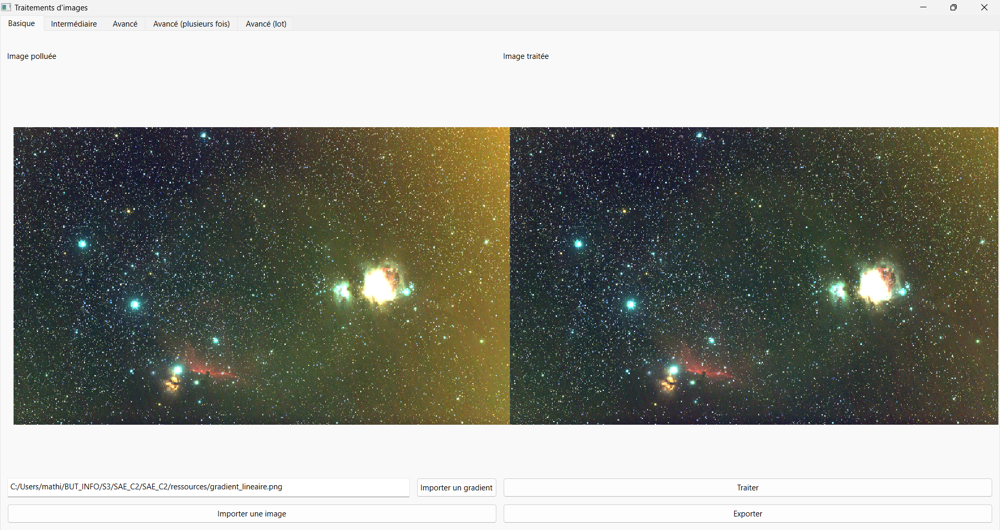
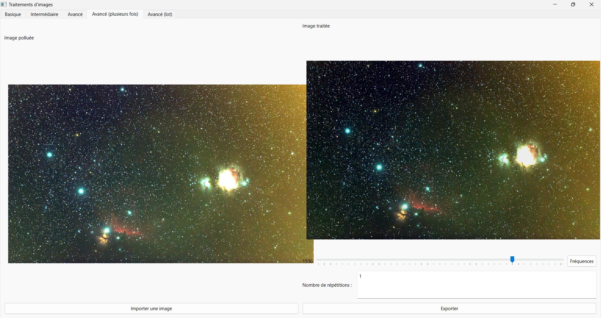
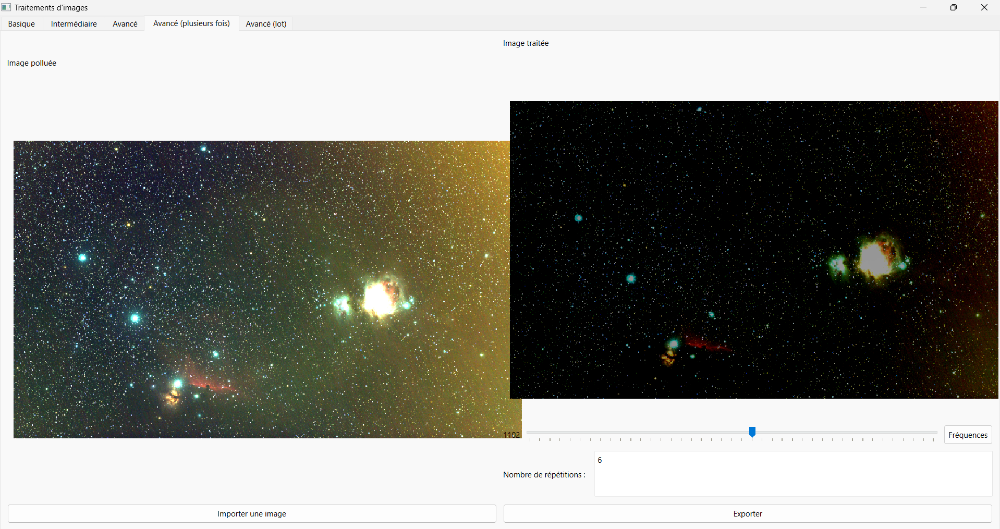
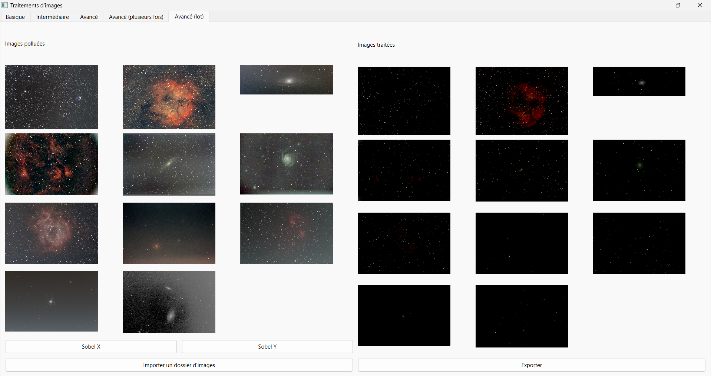

---
title: Documentation application traitement d'images
...

# Application de traitement d'images polluées par pollution lumineuse

La pollution lumineuse est un signal supplémentaire dans l’image. La forme de ce signal est celui d’un gradient[^gradient] ajouté.

Pour retirer le gradient il faut d’abord l’_estimer_. Pour calculer le gradient on peut le considérer comme linéaire (c’est une bonne approximation). Si on souhaite un résultat plus précis on peut utiliser d’autres méthodes comme utiliser des polynômes d’ordre supérieur.

Ensuite on peut _retirer_ le gradient. On soustraire le gradient estimé précédemment à l’image de départ.

## Basique

### Fonctionnement du traitement

Dans le cas de l'onglet _Basique_, il n'y a pas de calcul du gradient. Celui ci est déjà calculé et stocké dans un fichier.

### Interface

La partie de gauche affiche l'image originale non traitée. La partie de droite affiche l'image après traitement.

La zone du bas permet d'importer le gradient et affiche le chemin complet vers le fichier.
Le bouton en dessous permet d'importer l'image polluée.
À droite, le bouton _**Traiter**_ permet d'effectuer la soustraction du gradient importé à l'image originale.
Le bouton _**Exporter**_ permet de sauvegarder l'image traitée.

$\\$

## Intermédiaire

L'onglet intermédiaire permet d'appliquer le filtre de Sobel[^Sobel] par X ou par Y à l'image.

### Fonctionnement du traitement

Le filtre de Sobel utilise des matrices de convolution. On peut effectuer les traitements horizontalement ou verticalement.
Soit $A$ la matrice qui représente l'image source et
$G _{x}$
et $G _{y}$ les deux images qui contienent les approximations de la dérivée horizontale et verticale de chaque point :

$G\_{x}=\begin{bmatrix}
-1 & 0 & 1 \\
-2 & 0 & 2 \\
-1 & 0 & 1
\end{bmatrix}  * A$
et
$G\_{x} = \begin{bmatrix}
-1 & -2 & -1 \\
0 & 0 & 0 \\
1 & 2 & 1
\end{bmatrix} * A$

où \* représente l'opération matricielle de convolution.

En chaque point, les approximations des gradients horizontaux et verticaux peuvent être combinées comme suit pour obtenir une approximation de la norme du gradient :
$G=\sqrt{G _{x}^2+G _{y}^2}$

### Interface

La partie de gauche affiche l'image originale non traitée. La partie de droite affiche l'image après traitement.

Les boutons permettent d'appliquer le **filtre de Sobel** par X ou par Y sur l'image originale.
Le bouton du bbas permet d'importer l'image polluée.
Le bouton _**Exporter**_ permet de sauvegarder l'image traitée.

$\\$

## Avancé

### Normal

La méthode de traitement utilise la fréquence[^fréquence] pour supprimer la pollution lumineuse.
On peut sélectionner la fréquence entre 500 et 1500.
On supprimer la fréquence 1 seule fois.

#### Interface

La partie de gauche affiche l'image originale non traitée. La partie de droite affiche l'image après traitement.

À droite, un curseur permet de choisir la fréquence à appliquer. Le bouton **Fréquences** permet d'appliquer la fréquence à l'image originale.
Le bouton _**Exporter**_ permet de sauvegarder l'image traitée.

$\\$

### Plusieurs fois

Cette méthode reprend la méthode précédente en l'appliquant au résultat obtenu et ce à plusieurs reprise.

#### Interface

La partie de gauche affiche l'image originale non traitée. La partie de droite affiche l'image après traitement.

À droite, un curseur permet de choisir la fréquence à appliquer. Le bouton **Fréquences** permet d'appliquer la fréquence à l'image originale.
On peut également choisir le nombre de répétitions à faire.
Le bouton _**Exporter**_ permet de sauvegarder l'image traitée.

$\\$

### Par lot

Il est possible de vouloir traiter un grand nombre d'images en une seule fois. Pour cela l'onglet par lot permet d'appliquer le filtre de Sobel à l'ensemble des images d'un dossier.

#### Interface

La partie de gauche affiche les images non traitées du dossier sélectionner. La partie de droite affiche les images après traitement.

À droite, un curseur permet de choisir la fréquence à appliquer. Le bouton **Fréquences** permet d'appliquer la fréquence à l'image originale.
On peut également choisir le nombre de répétitions à faire.
Le bouton _**Exporter**_ permet de sauvegarder l'image traitée.

$\\$

[^Sobel]: le filtre de Sobel aussi appelé opérateur de Sobel ou opérateur de Sobel-Feldman est un opérateur utilisé pour la détection de contours.
[^gradient]: Un gradient est une variation, progressivement décroissante à partir d'un point maximal
[^fréquence]: Nombre de périodes ou de cycles complets de variations qui se succèdent en une seconde
